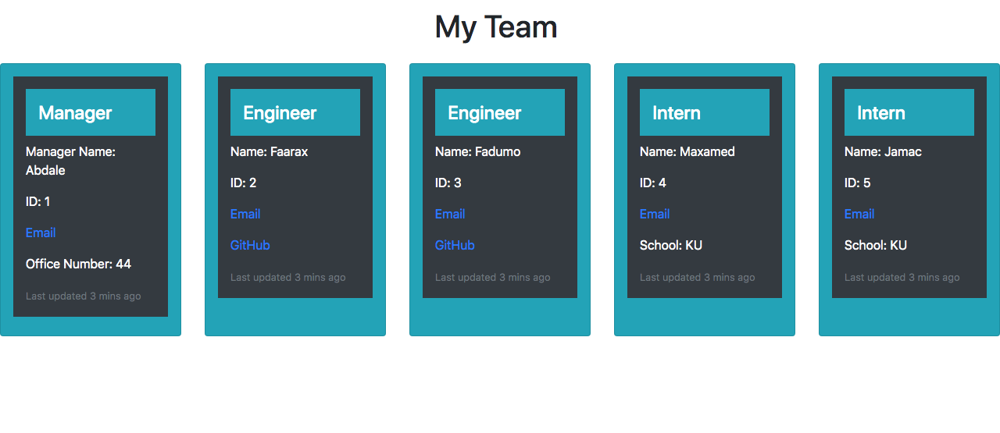

## Team Profile Generator

## License
   GitHub License 
   
## Description
 This app is a  Node.js command-line application that takes in information about employees on a software engineering team, then generates an HTML webpage that displays summaries for each person. Hence, it will generate a profile for a manager, engineer(s), and intern(s).  
   
   ## Table of Contents

   * [Installation](#installation)

   * [Usage](#usage)

   * [License](#license)

   * [Contribution](#contributing)

   * [Testing](#testing)

   * [Questions](#questions)

## Installation
  In order, to install this app, you need to run this command:                                              `npm i`

## Usage
 For usage, please run the following command:                                                   `node index.js`

## License
This project is licensed under the MIT license.
 
 

## Contributing
 Abdale Hassan

## Testing
 In order to test it, please run the following command:  `npm run test`

## Questions
Please send me an eamil for further information.
cabdale989@gmail.com
![]https://github.com/
     
    

![Video animation]https://youtu.be/1EEx9ePRNPA

